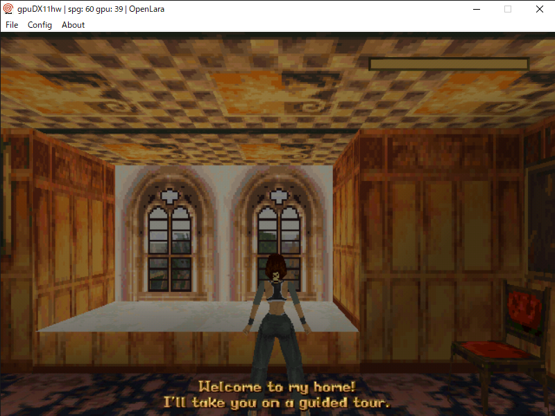

# OpenLara Dreamcast
<p align="center"></p>

This is a port of [OpenLara](https://github.com/XProger/OpenLara) for the Sega Dreamcast.

## Setup instruction
require PC version assets of tomb raider. [Tomb Raider 1+2+3](https://www.gog.com/game/tomb_raider_123)

- C:/Steam/steamapps/common/Tomb Raider or C:/GOG Games/Tomb Raider
- how to extract from images mount dosbox.exe
```bash
mount C .
imgmount d ".\game.dat" -t iso -fs iso
xcopy D:\DATA\ C:\DATA\
```
- Optional: DELDATA included in psone version of tomb raider for level or tittle screen
- Optional: TRACKS.IMA in [gba demo](https://github.com/XProger/OpenLara/tree/master/src/platform/gba/data)
- example
```bash
  DATA/*.PHD
  DELDATA/*.RAW
  DATA/TRACKS.IMA
```
## Burning
- cdi image at release page not include game data.
- cdi
    - you can burn with [Image Burn](https://www.imgburn.com/index.php?act=download)

## Credits
- XProger
- Histat
